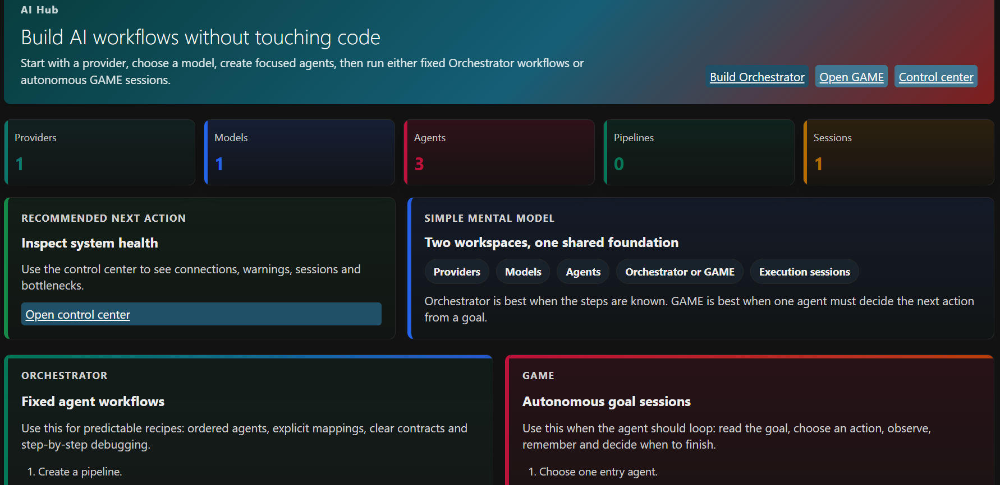
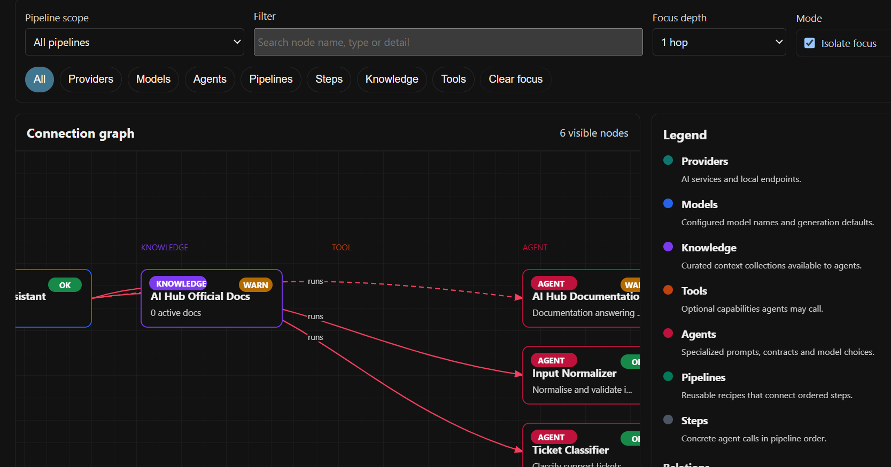
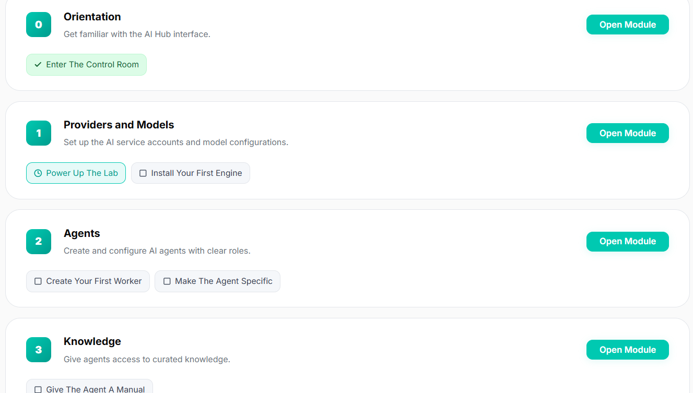
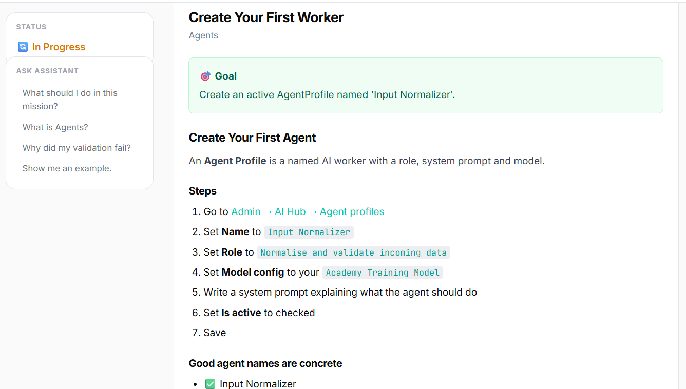
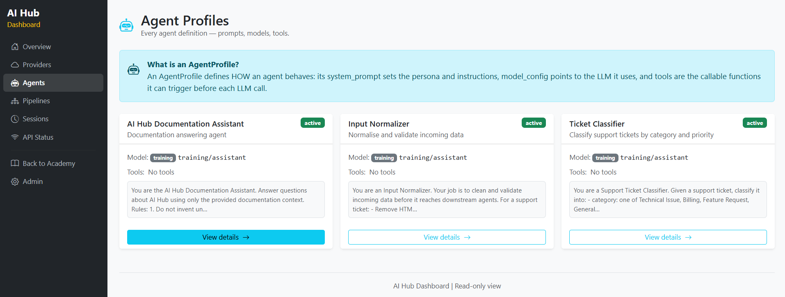
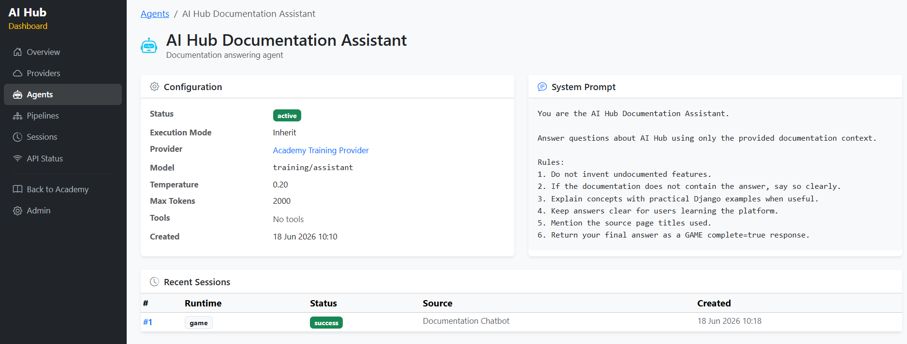

# AI Hub Academy

A demonstration and training platform built on top of **AI Hub** — a reusable Django app for building, running, and auditing AI workflows.

Use it to learn how AI pipelines work, explore live execution telemetry, and understand how to integrate LLMs into any Django project.

---

## Quick start

### Prerequisites

| Requirement | Minimum | Notes |
|---|---|---|
| Python | 3.12+ | [python.org/downloads](https://www.python.org/downloads/) |
| Git | any | to clone the repo |

> **No API keys needed.** The project ships with a Training provider that returns deterministic responses — everything works out of the box.

---

### 1. Clone the repo

```bash
git clone https://github.com/Vgarcan/ai_hub-academy_app.git
cd ai_hub-academy_app
```

---

### 2. Run the setup script

```bash
python setup_dev.py
```

That's it. The script does everything for you (it takes a few minutes — installing
the packages is the slow part). It will:
- create a virtual environment (`venv/` — an isolated, private copy of Python just for this project)
- install all packages
- create `.env` with a generated secret key
- run database migrations
- seed tutorial and training data
- import documentation from `docs_source/`
- create an admin superuser (`admin` with a generated password)

> ⚠️ **Copy the admin password now.** When the script finishes it prints a line like
> `Admin login:  admin / <random-password>`. This is the only time it is shown. Paste
> it somewhere safe — you'll need it to log into `/admin/`. (Lost it? See *Troubleshooting*.)

---

### 3. Activate the venv and start the server

"Activating the venv" tells your terminal to use this project's private Python (the
one with all the packages installed) instead of your system Python. You do this in
**every new terminal window** before running project commands.

**Windows**
```cmd
venv\Scripts\activate
python manage.py runserver
```

**macOS / Linux**
```bash
source venv/bin/activate
python manage.py runserver
```

You'll know it worked when your prompt starts with `(venv)`. After `runserver`, leave
that terminal open — it's running the website. You should see
`Starting development server at http://127.0.0.1:8000/`.

Now open **http://localhost:8000/** in your browser.

> **To stop the server:** press `Ctrl + C` in that terminal.
> **To start it again later:** open a terminal, `cd` into the project, activate the
> venv (step above), and run `python manage.py runserver` again. You only run
> `setup_dev.py` once, ever.

---

## Where to go first

| URL | What you'll find |
|---|---|
| `http://localhost:8000/` | Academy home — docs, tutorials, assistant |
| `http://localhost:8000/docs/` | Documentation browser |
| `http://localhost:8000/tutorials/` | Interactive tutorial missions |
| `http://localhost:8000/assistant/` | AI documentation chatbot |
| `http://localhost:8000/dashboard/` | Visual dashboard — all AI Hub entities |
| `http://localhost:8000/admin/` | Django admin (`admin`; setup prints the generated password) |
| `http://localhost:8000/admin/ai_hub/` | AI Hub control panel |

---

## Project structure

```
manage.py              Entry point
setup_dev.py           One-command dev setup (run once after cloning)
requirements.txt       Python dependencies
.one-env.example       Environment variable template
docs_source/           Markdown documentation source files

_core/                 Django project settings, URLs, WSGI
ai_hub/                Reusable AI orchestration app  ← the core
academy/               Documentation, tutorials, chatbot
support_demo/          Demo scenario: support ticket triage
dashboard/             Visual Bootstrap dashboard
templates/             Shared HTML templates
static/                Static files
```

---

## The apps

### `ai_hub` — the reusable core

Plug-and-play Django app. Copy the folder, add it to `INSTALLED_APPS`, run `migrate`.



Provides:
- **ProviderConfig** — connection to an AI service (OpenAI, Ollama, Anthropic, or Training stub)
- **ModelConfig** — a specific model with temperature and token defaults
- **AgentProfile** — a system prompt + model + optional tools
- **PipelineDefinition** — fixed sequence of agent calls (Orchestrator mode)
- **ExecutionSession** — one full pipeline run, fully audited
- **GAME runtime** — autonomous agent loop that runs until `complete: true`



### `academy` — the learning layer

- Documentation browser (Markdown → database, full-text search)
- Interactive tutorials: 9 modules, 14 missions — each validates real Admin state
- AI Documentation Assistant powered by an ExecutionSession for auditability
- Progress tracking per user



### `support_demo` — a realistic demo

- `SupportTicket` model linked to `ExecutionSession`
- Two-step triage pipeline: Input Normalizer → Ticket Classifier
- Shows governance: every AI decision is logged with full request/response telemetry



### `dashboard` — visual exploration

Bootstrap 5 read-only dashboard showing every AI Hub entity with educational annotations.
- Providers, Models, Agents, Pipelines, Sessions
- GAME audit trail: per-iteration tool results + LLM decisions




---

## Manual setup (if you prefer not to use setup_dev.py)

```bash
# 1. Create and activate venv
python -m venv venv
source venv/bin/activate        # macOS/Linux
# venv\Scripts\activate         # Windows

# 2. Install packages
pip install -r requirements.txt

# 3. Create .env
cp .one-env.example .env        # macOS/Linux
# copy .one-env.example .env    # Windows
# Edit SECRET_KEY in .env

# 4. Migrate
python manage.py migrate

# 5. Seed data
python manage.py seed_academy_training_data
python manage.py import_academy_docs

# 6. Create admin user
python manage.py createsuperuser

# 7. Start server
python manage.py runserver
```

---

## Management commands

| Command | What it does |
|---|---|
| `python manage.py migrate` | Apply all database migrations |
| `python manage.py seed_academy_training_data` | Create training provider, agents, tutorial modules and missions |
| `python manage.py import_academy_docs` | Import Markdown files from `docs_source/` into the database |
| `python manage.py seed_ollama_agents` | Set up Ollama provider and GAME agents (requires local Ollama) |
| `python manage.py run_doc_sync` | Run the Documentation Sync GAME agent once |
| `python manage.py embed_docs` | Generate semantic embeddings for all documentation chunks (requires Ollama with `bge-m3:latest`) |
| `python manage.py embed_docs --force` | Re-generate embeddings even for chunks that already have one |
| `python manage.py test` | Run the full test suite |
| `python manage.py createsuperuser` | Create an admin user interactively |

---

## Using a real AI provider

The Training provider works without any API key and is active by default. When you're ready to use a real LLM, you have two paths depending on where you are in the setup.

### Before installation — add your key to `.env` first

1. Copy the environment template before running `setup_dev.py`:

   **Windows**
   ```cmd
   copy .one-env.example .env
   ```
   **macOS / Linux**
   ```bash
   cp .one-env.example .env
   ```

2. Open `.env` and uncomment the relevant line:

   ```env
   # OpenAI
   OPENAI_API_KEY=sk-...

   # Anthropic
   ANTHROPIC_API_KEY=sk-ant-...

   # Ollama (local, no key needed — just set the URL)
   OLLAMA_BASE_URL=http://localhost:11434
   ```

3. Run `python setup_dev.py` as normal. The key will be available to Django from the first start.

4. After setup, go to **Admin → AI Hub → Provider configs → Add** and create a provider pointing to your key's environment variable name.

---

### After installation — add your key once the server is running

1. Open `.env` in the project root and add your key:

   ```env
   OPENAI_API_KEY=sk-...
   ```

2. **Restart the server** — Django reads `.env` at startup, so the new key only takes effect after restart.

3. Go to **Admin → AI Hub → Provider configs → Add** and fill in:
   - `provider_type`: `openai`, `anthropic`, or `ollama`
   - `api_key_env_var`: the exact variable name you added to `.env` (e.g. `OPENAI_API_KEY`)
   - `base_url`: only needed for Ollama or custom endpoints

4. Go to **Admin → AI Hub → Model configs → Add** and create a model linked to the new provider.

5. Edit each **Agent profile** and switch its model config to the new one.

You do not need to delete the Training provider — it is safe to leave it active alongside a real one.

---

### Ollama — local LLM, no API key, no cost

The fastest path to a real model. Requires [Ollama](https://ollama.ai) installed and running locally.

```bash
# Pull the LLM and the embedding model (one-time downloads)
ollama pull qwen3:8b
ollama pull bge-m3

# Seed Ollama provider and GAME agents into the database
python manage.py seed_ollama_agents --base-url http://localhost:11434

# Smoke test — run the Documentation Sync GAME agent once
python manage.py run_doc_sync

# Generate semantic embeddings for the documentation assistant
# This enables vector search in the chat — without it the assistant falls back to keyword-only search
python manage.py embed_docs --model bge-m3:latest
```

> **Why `embed_docs` matters:** the documentation assistant supports two search modes. When embeddings exist, it uses semantic (vector) search via cosine similarity — finding relevant content even when the user's words don't match the docs exactly. Without embeddings it falls back to keyword filtering, which misses paraphrased or conceptual questions. Run `embed_docs` once after `import_academy_docs`, and again after any bulk documentation update.

---

## Running tests

```bash
python manage.py test
# the full suite should pass
```

---

## Architecture at a glance

```
ProviderConfig
    └── ModelConfig
            └── AgentProfile  ──(tools)──  ToolDefinition
                    └── PipelineDefinition
                                └── PipelineStep
                                        └── ExecutionSession
                                                └── ExecutionStepRun
```

Every AI call creates an `ExecutionSession` with one `ExecutionStepRun` per step (or per GAME iteration). You can inspect the full request payload, response payload, and latency for every call in the admin or the dashboard.

---

## Troubleshooting

**I lost the admin password printed by `setup_dev.py`**
→ Set a new one. Activate the venv, then run `python manage.py changepassword admin`
and type a new password (the characters stay hidden as you type — that's normal).

**`ModuleNotFoundError: No module named 'django'`**
→ Activate the virtual environment first: `venv\Scripts\activate` (Windows) or `source venv/bin/activate` (macOS/Linux). Your prompt should then start with `(venv)`.

**`OperationalError: no such table`**
→ Run `python manage.py migrate`

**`TemplateDoesNotExist`**
→ Make sure you're running from the project root (the folder with `manage.py`)

**Tutorials show no data**
→ Run `python manage.py seed_academy_training_data`

**Documentation pages missing**
→ Run `python manage.py import_academy_docs`

**Port already in use**
→ `python manage.py runserver 8001` to use a different port

**API key added to `.env` but provider still fails**
→ Restart the server — Django reads `.env` once at startup, changes are not hot-reloaded. Also confirm the `api_key_env_var` field in the Provider config matches the variable name in `.env` exactly (case-sensitive).

**Provider is active but every session fails immediately**
→ Run `python manage.py shell -c "import os; print(repr(os.getenv('YOUR_VAR_NAME')))"` to confirm the key is actually loaded. If it prints `None`, check that `.env` is in the project root (same folder as `manage.py`).

**Ollama configured but provider shows connection error**
→ Confirm Ollama is running (`ollama list` in a terminal). Check that `base_url` in the Provider config matches the Ollama address (default `http://localhost:11434`). If running inside Docker or WSL, `localhost` may not resolve — use the host machine IP instead.

**Documentation assistant gives vague or off-topic answers**
→ The assistant is likely using keyword-only search because no embeddings have been generated. Run:
```bash
python manage.py embed_docs --model bge-m3:latest
```
Confirm `bge-m3:latest` is installed in Ollama (`ollama list`). Pull it first if missing: `ollama pull bge-m3`. After the command completes, all documentation chunks will have vector embeddings and the assistant will use semantic search automatically.

**`embed_docs` skips all chunks and says "All chunks already embedded"**
→ Embeddings already exist. To force a full refresh (e.g. after updating the documentation source), run:
```bash
python manage.py embed_docs --force
```
